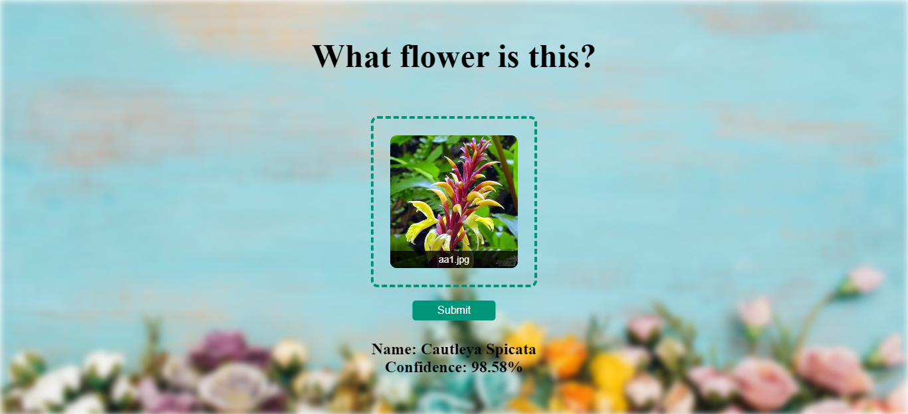

# Flower Recognition Website



The website recognizes 102 different species of flowers (all flower names are in JSON file: `dataset/cat_to_name.json`). Firstly, a CNN model was built using transfer learning (MobileNetV2) on images from [Kaggle dataset](https://www.kaggle.com/datasets/spaics/hackathon-blossom-flower-classification). Secondly, created a server API using Flask and FastAPI in Python. At the end, created User Interface using HTML, CSS and JavaScript.

## How to run the website on your computer?
1. Go to `server` folder
```bash
cd server
```

2. Install Python packages
```
pip3 install -r requirements.txt
```

3. Run Flask or FastAPI server
```
python server-Flask.py
```
or
```
python server-FastAPI.py
```

4. Open HTML file `UI/app.html`

## Folder structure
* UI: Contains UI website code
* dataset: Dataset used for training and testing built model downloaded from Kaggle: https://www.kaggle.com/datasets/spaics/hackathon-blossom-flower-classification 
* models: Contains saved models
* server: Python Flask and FastAPI server 
* training: Contains Python notebooks for building models 

## Technologies used in the project
* Python 
* Numpy 
* Matplotlib for data visualization
* Pandas for saving predictions in `test set` 
* Tensorflow for building model 
* Pillow for reading image files
* Flask/FastAPI for http server 
* HTML/CSS/JavaScript for creating User Interface
* Google Colab, Jupyter notebook and Visual Studio Code as IDE
* Postman for testing API

